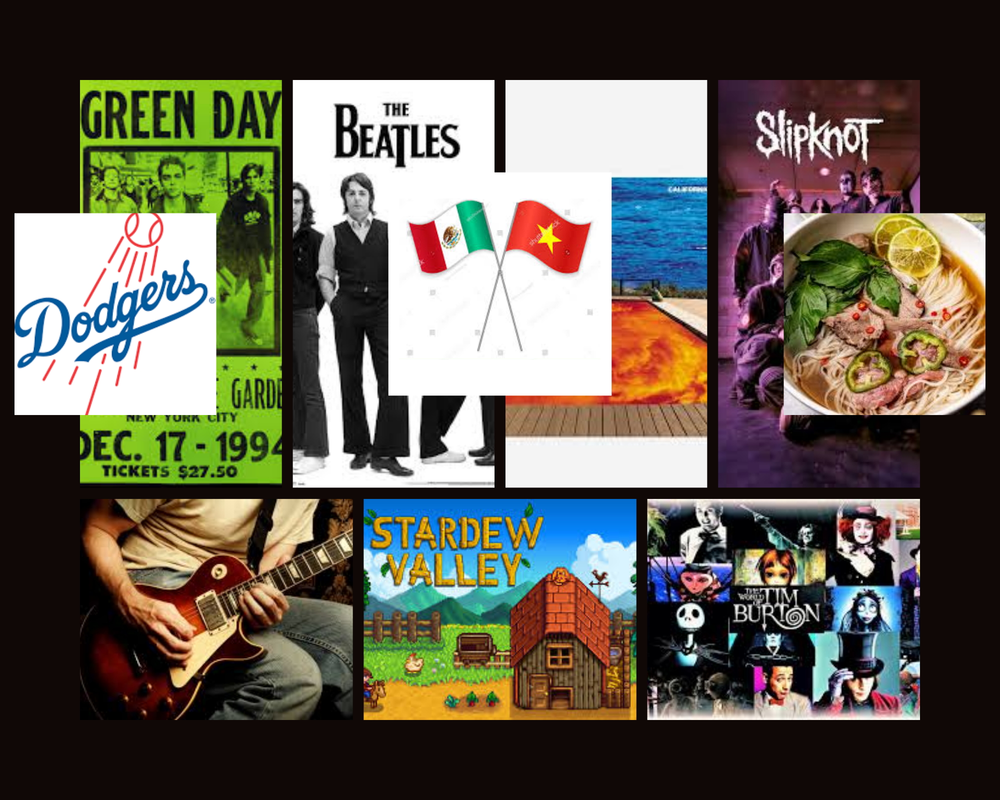

# Me in Markdown

## Introduction

My name is Vincent Vo and I am in the 11th grade, I ended up joining the magnet lat year since I missed the deadline for my application in Freshman Year. One of my favorite movies, or not really a movie but one that will be in theaters soon is Hamilton, it's quite popular but if you don't know it is a musical about the founding fathers (including Alexander Hamilton of course) building the young country of America after our declaration of independence with lots of hip hop, but amazing music, I love the choreography and little details added to each song it makes it very special to me as I've been liking it for almost 6 years now and brought me into the world of musical theater. Of course it isn't my only personality trait but it is one I'm able to talk about easily and enjoy talking about.

One of my favorite hobbies to in my free time is to play guitar, I enjoy playing it because it can sometimes be calming and just help me when I'm overwhelmed or stressed out. I can play some song by the Beatles like Yesterday and Blackbird, I can also play some classics like Spanish Romance, Habanera, and Fly Me to the Moon. I've been learning since I was around 7 and I've loved it ever since as it's stuck with me since elementary. I've also learned some songs by Green Day such as American Idiot, Holiday, and Brainstew. I'm currently trying to learn to sing as well while I play guitar but it could definitely use some work.

## My Playlist

[This is my Spotify playlist](https://open.spotify.com/playlist/5D1sSzYl7hUw0U3IUkwV0i)

## Collage/Moodboard

